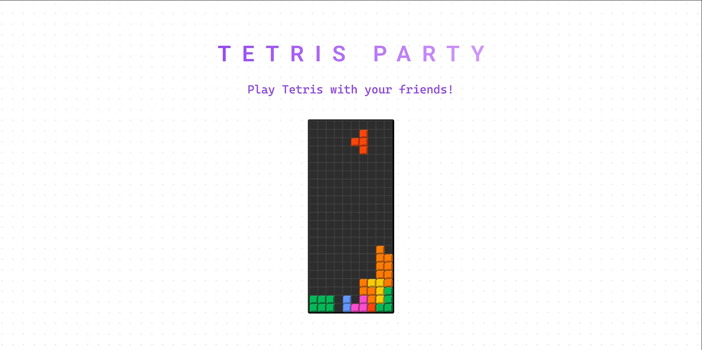

<p align="center">
  
  <br />
  <br />
</p>

# Tetris Party

**[Tetris Party](https://www.figma.com/community/widget/1067458900580099402/Tetris-Party) is a [Figma](https://figma.com/) widget**

Here is a demo: [Play !](https://little-mighty-snickerdoodle.glitch.me/)


## Architecture

- [Architecture (English)](./ARCHITECTURE.md)
- [아키텍처 설명 (한국어)](./ARCHITECTURE_ko.md)

## Development

```bash
# clone the repo
git clone https://github.com/let-sunny/tetris-party.git

# install dependencies
npm install

# start
npm run dev

# test
npm run test:unit
```

## Used tools

- Typescript
- React
- [Vite](https://vitejs.dev/)
- Jest
- Storybook

Template from [create-widget-app](https://github.com/figma/widget-samples/tree/main/create-widget-app)
